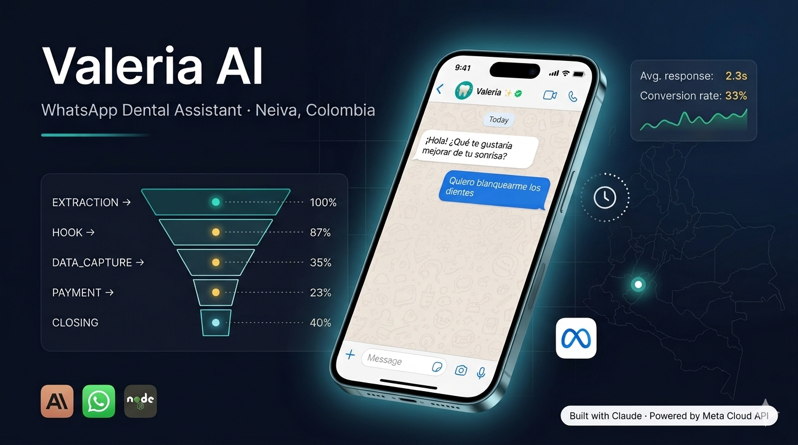

# 🦷 Valeria — AI WhatsApp Assistant · Dra. Yuri Quintero




> AI-powered WhatsApp Business assistant for **Dra. Yuri Quintero — Perfeccionamiento dental #OdontologíaHechaConAmor**,
> Neiva, Colombia.  
> Handles inbound inquiries 24/7 on a dedicated line, qualifies patients, and guides them to book a consultation.

**Dedicated line architecture** — every person who messages is treated as a potential patient. No trigger filtering, no
supplier detection.

---

## Table of Contents

- [Features](#features)
- [Tech Stack](#tech-stack)
- [Project Structure](#project-structure)
- [Conversation Flow](#conversation-flow)
- [Message Classification](#message-classification)
- [Setup](#setup)
- [Deployment](#deployment)
- [API Endpoints](#api-endpoints)
- [Testing](#testing)
- [Security](#security)
- [Documentation](#documentation)
- [License](#license)

---

## Features

| Feature                    | Description                                                          |
|----------------------------|----------------------------------------------------------------------|
| 24/7 availability          | Responds instantly regardless of office hours                        |
| Natural conversation       | Warm Colombian Spanish (`tú`), first person plural ("nosotros")      |
| Multiphase conversion flow | Guides patient from first contact to deposit                         |
| Silent data extraction     | Captures name and goal without interrupting flow                     |
| Universal re-engagement    | 24h follow-up timer active in every phase (EXTRACTION→CLOSING)       |
| Approximate price ranges   | Shares treatment ranges when patient insists — never exact prices    |
| Intent tracking            | Logs objection type, phase, and outcome per patient                  |
| Supabase CRM               | Patient data persisted in Supabase (survives server restarts)        |
| Retry logic                | Exponential backoff on Claude API errors (529/503/500)               |

---

## Tech Stack

| Component | Solution                                  |
|-----------|-------------------------------------------|
| Runtime   | Node.js 18+ / Express                     |
| AI        | Anthropic Claude `claude-sonnet-4-6`      |
| Messaging | Meta WhatsApp Cloud API                   |
| Hosting   | Render.com                                |
| Database  | Supabase (PostgreSQL) — patient CRM       |
| Tests     | Vitest — 94 tests, 7 suites, 100% passing |

---

## Project Structure

```
valeria-dental-bot/
├── server.js          ← Express entry point
├── src/               ← Application modules (config, crm, ai, flow, …)
│   ├── routes/        ← webhook.js, debug.js
│   └── utils/         ← logger.js, time.js
├── tests/             ← Vitest test suites (7 suites, 95 tests)
├── .claude/           ← Claude Code settings and slash commands
└── *.md               ← Documentation (README, CLAUDE, SECURITY, PROJECT_FILES)
```

See [PROJECT_FILES.md](./PROJECT_FILES.md) for the full module reference and test inventory.

---

## Conversation Flow

```
EXTRACTION → HOOK → DATA_CAPTURE → PAYMENT → CLOSING
```

| Phase          | Trigger                   | Action                               |
|----------------|---------------------------|--------------------------------------|
| `EXTRACTION`   | No name or aesthetic goal | AI extracts name + goal naturally    |
| `HOOK`         | Name + goal both known    | Hardcoded consultation pitch         |
| `DATA_CAPTURE` | Positive response to hook | Collects full name, email, reason    |
| `PAYMENT`      | Data complete             | AI sends banking details for deposit |
| `CLOSING`      | Payment instructions sent | Awaits receipt, confirms appointment |

### Internal AI Signals

The AI appends these signals to its responses — they are never shown to the patient:

```
NAME: [name]           → intent.js updates session.name
GOAL: [goal]           → intent.js updates session.aesthetic_goal
EXTRACTED: full_name: [...], email: [...], consultation_reason: [...]
```

`stripSignals()` in `flow.js` removes all signals before `sendMessage()`.

---

## Message Classification

Four rules evaluated in priority order:

| Priority | Condition                        | Action                         |
|----------|----------------------------------|--------------------------------|
| 1        | Group message                    | `IGNORE`                       |
| 2        | Phone status = `IN_TREATMENT`    | `CURRENT_PATIENT`              |
| 3        | Active session (phase ≠ `START`) | `ORGANIC_LEAD`                 |
| 4        | Any new individual contact       | `WARM_LEAD` (`source: DIRECT`) |

---

## Setup

### Prerequisites

- Node.js ≥ 18
- Meta WhatsApp Business account with Cloud API access
- Anthropic API key

### Local Development

```bash
git clone https://github.com/leosalazarn/valeria-dental-bot.git
cd valeria-dental-bot
npm install
cp .env.example .env    # fill in your credentials — never commit this file
npm run dev
```

### Environment Variables

```env
ANTHROPIC_API_KEY=...       # Anthropic Console → API Keys
WA_ACCESS_TOKEN=...         # Meta → System Users → permanent token
WA_PHONE_NUMBER_ID=...      # Meta phone number ID
VERIFY_TOKEN=...            # Webhook verification token (your choice)
BANK_HOLDER_NAME=...        # Account holder full name
BANK_HOLDER_CC=...          # Account holder national ID
BANCOLOMBIA_ACCOUNT=...     # Bancolombia savings account number
NEQUI_NUMBER=...            # Nequi phone number
DAVIVIENDA_ACCOUNT=...      # Davivienda savings account number
SUPABASE_URL=...            # Supabase → Project Settings → API → Project URL
SUPABASE_ANON_KEY=...       # Supabase → Project Settings → API → anon public key
```

> ⚠️ Banking credentials must live **only** in environment variables — never in source code, logs, or documentation.
> See [SECURITY.md](./SECURITY.md).

---

## Deployment

### Render.com

1. Push to GitHub — confirm `.env` is in `.gitignore`
2. Create a new **Web Service** on [Render.com](https://render.com)
3. Connect the repository
4. Configure:
   - **Build command:** `npm install`
   - **Start command:** `npm start`
5. Add all environment variables in the Render dashboard
6. Deploy — copy the production URL
7. Set Meta webhook URL: `https://your-app.onrender.com/webhook`

> ⚠️ Upgrade to the **$7/month** paid plan before going live. The free plan sleeps after 15 minutes of inactivity,
> causing missed messages.

---

## API Endpoints

| Method | Endpoint   | Purpose                                           |
|--------|------------|---------------------------------------------------|
| `GET`  | `/`        | Health check                                      |
| `GET`  | `/webhook` | Meta webhook verification                         |
| `POST` | `/webhook` | Receive inbound WhatsApp messages                 |
| `GET`  | `/leads`   | All patients in memory *(debug only)*             |
| `GET`  | `/stats`   | Summary by source / status / phase *(debug only)* |

> ⚠️ `/leads` and `/stats` expose patient data without authentication. Restrict or remove before high-volume production
> use. See [SECURITY.md § Known Limitations](./SECURITY.md#known-limitations).

---

## Testing

```bash
npm test            # run full suite once
npm run test:watch  # watch mode during development
```

95 tests across 7 suites — all passing. See [PROJECT_FILES.md § Test Suite](./PROJECT_FILES.md#test-suite) for full
coverage breakdown.

---

## Security

See [SECURITY.md](./SECURITY.md) for:

- Sensitive data classification and storage policy
- Credential rotation guidelines
- Input validation and injection prevention
- Patient privacy rules
- Vulnerability reporting process
- Known limitations

---

## Documentation

| File                                   | Purpose                                       |
|----------------------------------------|-----------------------------------------------|
| [README.md](./README.md)               | Setup, architecture, deployment *(this file)* |
| [CLAUDE.md](./CLAUDE.md)               | Full project context for AI assistant handoff |
| [SECURITY.md](./SECURITY.md)           | Security policy and vulnerability reporting   |
| [PROJECT_FILES.md](./PROJECT_FILES.md) | Module reference and test inventory           |

---

## License

Proprietary — All rights reserved.  
Developed for **Dra. Yuri Quintero — Perfeccionamiento dental #OdontologíaHechaConAmor**, Neiva, Huila, Colombia.
