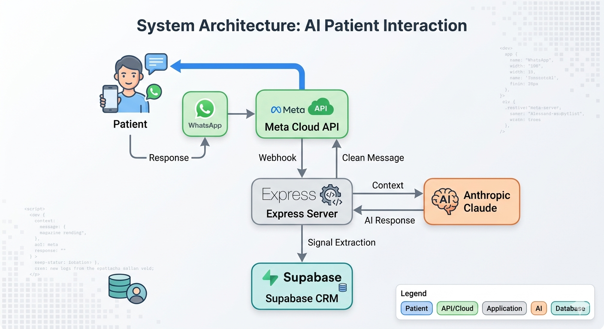
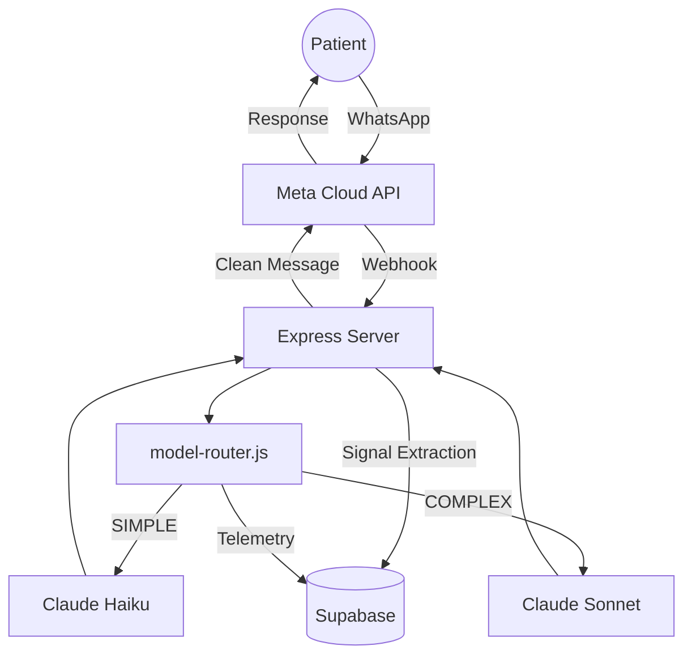

# 🦷 Valeria — AI WhatsApp Assistant · Dra. Yuri Quintero


> AI-powered WhatsApp Business assistant for **Dra. Yuri Quintero — Perfeccionamiento dental #OdontologíaHechaConAmor**,
> Neiva, Colombia.  
> Handles inbound inquiries 24/7 on a dedicated line, qualifies patients, and guides them to book a consultation.

**Dedicated line architecture** — every person who messages is treated as a potential patient. No trigger filtering, no
supplier detection.

---

## Table of Contents

- [Features](#features)
- [Tech Stack](#tech-stack)
- [Project Structure](#project-structure)
- [Conversation Flow](#conversation-flow)
- [Message Classification](#message-classification)
- [Setup](#setup)
- [Deployment](#deployment)
- [API Endpoints](#api-endpoints)
- [Testing](#testing)
- [Security](#security)
- [Documentation](#documentation)
- [License](#license)

---

## Features

| Feature                      | Description                                                                                                                  |
|------------------------------|------------------------------------------------------------------------------------------------------------------------------|
| 24/7 availability            | Responds instantly regardless of office hours                                                                                |
| Natural conversation         | Warm Colombian Spanish (`tú`), first person plural ("nosotros")                                                              |
| Multiphase conversion flow   | Guides patient from first contact to deposit                                                                                 |
| Silent data extraction       | Captures name and goal without interrupting flow                                                                             |
| Universal re-engagement      | 24h follow-up timer active in every phase (EXTRACTION→CLOSING)                                                               |
| Approximate price ranges     | Shares treatment ranges when patient insists — never exact prices                                                            |
| Intent tracking              | Logs objection type, phase, and outcome per patient                                                                          |
| Supabase persistence         | Leads, conversations, and metrics persisted in Supabase (survives server restarts)                                           |
| Gestión Odontológica handoff | Appointment data captured by Valeria is handed off to clinic staff for scheduling in the existing practice management system |
| Retry logic                  | Exponential backoff on Claude API errors (529/503/500)                                                                       |
| Multi-layer model routing    | Phase override → keyword scan → length heuristic → LLM-as-judge — routes FAQs to Haiku (fast/cheap), depth to Sonnet         |
| Router telemetry             | Per-session layer/model/token tracking persisted in Supabase; cost estimates in `/metrics`                                   |
| Input injection defense      | 10 regex patterns detect prompt injection before reaching the LLM                                                            |
| Output guardrails            | Bank data leak detection — blocks account numbers outside PAYMENT phase                                                      |

---

## Architecture





## Performance

- **Volume:** 200+ qualified patient conversations handled autonomously.
- **Conversion:** 40% conversion rate from first contact to data capture/deposit phase.
- **Tracking:** Real-time funnel analysis, drop-off rates, response times, and model-router telemetry (layer
  distribution, cost estimates) available via the `/metrics` endpoint.

---

## Tech Stack

| Component  | Solution                                                                                                                          |
|------------|-----------------------------------------------------------------------------------------------------------------------------------|
| AI         | Anthropic Claude — Haiku (`claude-haiku-4-5-20251001`) default, Sonnet (`claude-sonnet-4-6`) for complex queries via model-router |
| Server     | Node.js + Express (ES Modules)                                                                                                    |
| Database   | Supabase (PostgreSQL) — lead data & metrics                                                                                       |
| Scheduling | Gestión Odontológica — clinic staff manages appointments manually in their existing practice management system                    |
| WhatsApp   | Meta Cloud API                                                                                                                    |
| Hosting    | Render.com                                                                                                                        |

See [TECH_STACK.md](./docs/reference/TECH_STACK.md) for the full stack and key constants.

---

## Project Structure

```
valeria-dental-bot/
├── server.js          ← Express entry point
├── src/               ← Application modules (config, crm, ai, flow, model-router, guardrails, validators)
│   ├── routes/        ← webhook.js, debug.js
│   ├── guardrails/    ← AI output safety (bank data leak detection)
│   ├── validators/    ← Input sanitization + injection detection
│   ├── model-router.js ← multi-layer routing (phase/keyword/length/LLM → SIMPLE/COMPLEX)
│   └── utils/         ← logger.js, time.js
├── public/            ← Client-facing static files
│   └── dashboard.html ← Lead Dashboard UI
├── assets/            ← Static assets (logo-dra.png)
├── tests/             ← Vitest test suites (10 suites, 117 tests)
└── *.md               ← Documentation (README, CLAUDE, SECURITY, PROJECT_FILES)
```

See [PROJECT_FILES.md](./docs/PROJECT_FILES.md) for the full module reference and test inventory.

---

## Conversation Flow

See [BUSINESS_RULES.md](./docs/reference/BUSINESS_RULES.md) for the full flow, phase triggers, and message
classification rules.

---

## Message Classification

See [BUSINESS_RULES.md](./docs/reference/BUSINESS_RULES.md) for the classification rules.

---

## Setup

### Prerequisites

- Node.js ≥ 18
- Meta WhatsApp Business account with Cloud API access
- Anthropic API key

### Local Development

```bash
git clone https://github.com/leosalazarn/valeria-dental-bot.git
cd valeria-dental-bot
npm install
cp .env.example .env    # fill in your credentials — never commit this file
npm run dev
```

### Environment Variables

```env
ANTHROPIC_API_KEY=...       # Anthropic Console → API Keys
WA_ACCESS_TOKEN=...         # Meta → System Users → permanent token
WA_PHONE_NUMBER_ID=...      # Meta phone number ID
VERIFY_TOKEN=...            # Webhook verification token (your choice)
BANK_HOLDER_NAME=...        # Account holder full name
BANK_HOLDER_CC=...          # Account holder national ID
BANCOLOMBIA_ACCOUNT=...     # Bancolombia savings account number
NEQUI_NUMBER=...            # Nequi phone number
DAVIVIENDA_ACCOUNT=...      # Davivienda savings account number
SUPABASE_URL=...            # Supabase → Project Settings → API → Project URL
SUPABASE_ANON_KEY=...       # Supabase → Project Settings → API → anon public key
DEBUG_API_KEY=...            # Custom key for /debug/leads, /stats, /metrics protection
```

> ⚠️ Banking credentials must live **only** in environment variables — never in source code, logs, or documentation.
> See [SECURITY.md](./docs/SECURITY.md).

---

## Deployment

### Render.com

1. Push to GitHub — confirm `.env` is in `.gitignore`
2. Create a new **Web Service** on [Render.com](https://render.com)
3. Connect the repository
4. Configure:
    - **Build command:** `npm install`
    - **Start command:** `npm start`
5. Add all environment variables in the Render dashboard
6. Deploy — copy the production URL
7. Set Meta webhook URL: `https://your-app.onrender.com/webhook`

> ⚠️ Upgrade to the **$7/month** paid plan before going live. The free plan sleeps after 15 minutes of inactivity,
> causing missed messages.

---

## API Endpoints

See [ENDPOINTS.md](./docs/reference/ENDPOINTS.md) for all routes and auth requirements.

---

## Testing

```bash
npm test            # run full suite once
npm run test:watch  # watch mode during development
```

See [PROJECT_FILES.md § Test Suite](./docs/PROJECT_FILES.md#test-suite) for full coverage breakdown.

---

## Security

See [SECURITY.md](./docs/SECURITY.md) for:

- Sensitive data classification and storage policy
- Credential rotation guidelines
- Input validation and injection prevention
- Patient privacy rules
- Vulnerability reporting process
- Known limitations

---

## Documentation

| File                                                    | Purpose                                       |
|---------------------------------------------------------|-----------------------------------------------|
| [README.md](./README.md)                                | Setup, architecture, deployment *(this file)* |
| [CLAUDE.md](./CLAUDE.md)                                | Full project context for AI assistant handoff |
| [SECURITY.md](./docs/SECURITY.md)                       | Security policy and vulnerability reporting   |
| [PROJECT_FILES.md](./docs/PROJECT_FILES.md)             | Module reference and test inventory           |
| [TECH_STACK.md](./docs/reference/TECH_STACK.md)         | Canonical tech stack and constants            |
| [BUSINESS_RULES.md](./docs/reference/BUSINESS_RULES.md) | Rules, flow, and classification               |
| [ENDPOINTS.md](./docs/reference/ENDPOINTS.md)           | All API routes and auth                       |

---

## License

Proprietary — All rights reserved.  
Developed for **Dra. Yuri Quintero — Perfeccionamiento dental #OdontologíaHechaConAmor**, Neiva, Huila, Colombia.
