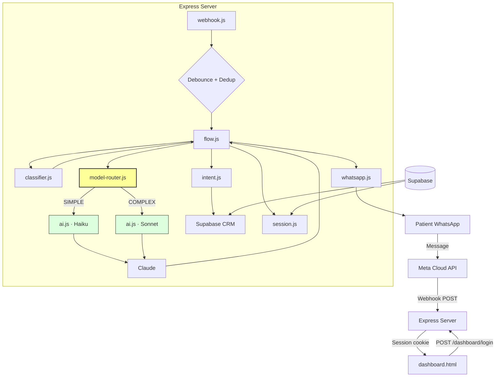

# Architecture — Valeria Dental Bot

> Mermaid diagram. Render with any Mermaid-compatible viewer (GitHub, VS Code, Mermaid Live Editor).

```mermaid
flowchart TD
    P[Patient WhatsApp] -->|Message| M[Meta Cloud API]
    M -->|Webhook POST| S[Express Server]

    subgraph Server[Express Server]
        direction TB
        W[webhook.js] --> D{Debounce + Dedup}
        D --> F[flow.js]
        F --> CL[classifier.js]
        CL --> F
        F --> MR[model-router.js]
        MR -- SIMPLE --> AI_H[ai.js · Haiku]
        MR -- COMPLEX --> AI_S[ai.js · Sonnet]
        AI_H --> Claude
        AI_S --> Claude
        F --> I[intent.js]
        I --> CRM[Supabase CRM]
        F --> WH[whatsapp.js]
        F --> SESS[session.js]
    end

    WH --> P
    Claude --> F

    DB[(Supabase)] --> CRM
    DB --> SESS

    DH[dashboard.html] -->|POST /dashboard/login| S
    S -->|Session cookie| DH

    style MR fill:#ff9,stroke:#333,stroke-width:2px
    style AI_H fill:#dfd,stroke:#333
    style AI_S fill:#dfd,stroke:#333
```
