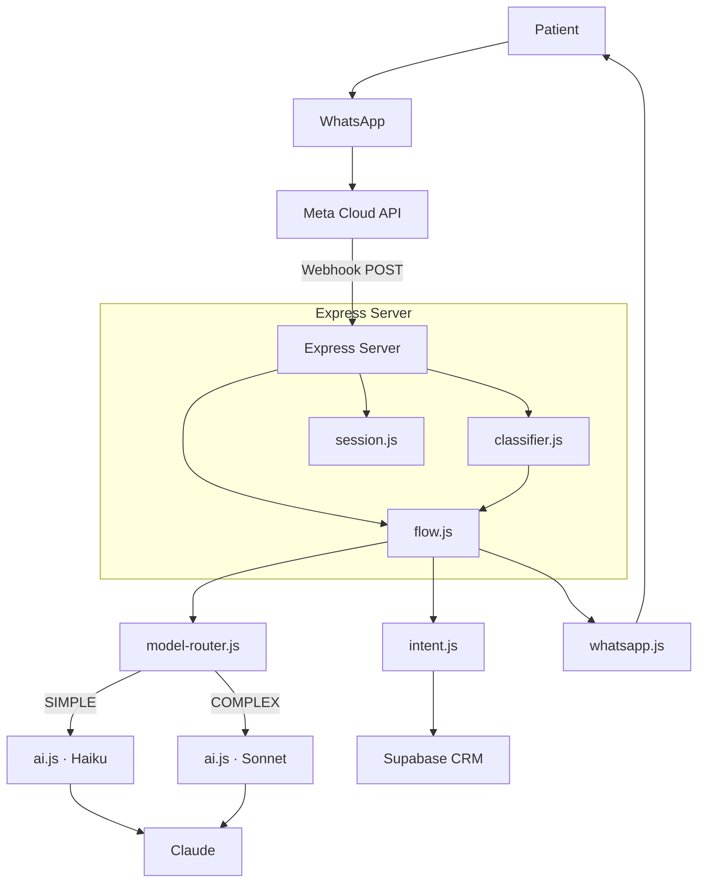

# Software Design Document — Valeria Dental Bot

## Version History

| Version | Date       | Author           | Changes                                                            |
|---------|------------|------------------|--------------------------------------------------------------------|
| 1.0     | 2026-05-12 | Leonardo Salazar | Initial version                                                    |
| 1.1     | 2026-06-06 | Leonardo Salazar | Added model-router, mermaid diagram                                |
| 1.2     | 2026-06-08 | Leonardo Salazar | Multi-layer routing (phase/keyword/length/LLM), wired into flow.js |
| 1.3     | 2026-06-10 | Leonardo Salazar | Router telemetry instrumentation — layer/token/ cost per session   |

---

## 1. Introduction

### 1.1 Purpose

Valeria is an AI-powered WhatsApp bot for **Dra. Yuri Quintero's** aesthetic dentistry practice. It captures leads from
Meta ads, qualifies them, collects patient data, and guides deposit payment for consultation appointments.

### 1.2 Scope

- **In scope:** Lead qualification, data capture, payment guidance, re-engagement, analytics
- **Out of scope:** Appointment scheduling (human receptionist), treatment pricing, clinical diagnosis
- **Gestión Odontológica handoff (pending evaluation):** Valeria captures patient data; clinic staff completes
  scheduling in their existing
  practice management system. Whether an API or webhook exists is unconfirmed — no integration work planned until
  evaluation is complete.

### 1.3 Definitions

| Term          | Definition                                                                            |
|---------------|---------------------------------------------------------------------------------------|
| Lead          | A person who messages the clinic's WhatsApp number                                    |
| Phase         | Stage in the conversion funnel (EXTRACTION → HOOK → DATA_CAPTURE → PAYMENT → CLOSING) |
| Signal        | Internal AI annotation (NAME:/GOAL:/EXTRACTED:) stripped before delivery              |
| Re-engagement | Automated follow-up message after 24h of silence                                      |

---

## 2. Architecture

### 2.1 High-Level Design

### 2.2 Design Decisions

| Decision                                  | Rationale                                                                                                                                                                |
|-------------------------------------------|--------------------------------------------------------------------------------------------------------------------------------------------------------------------------|
| Dedicated WhatsApp line                   | Every message is a potential patient — no trigger filtering needed                                                                                                       |
| Phase-based flow                          | Hardcoded hooks reduce AI hallucination at critical conversion points                                                                                                    |
| In-memory session + Supabase              | Low-latency reads with persistence across restarts                                                                                                                       |
| Gestión Odontológica (pending evaluation) | Valeria captures patient data; clinic staff completes scheduling. API availability unconfirmed — no integration work planned until evaluated                             |
| AI signal extraction                      | Claude appends NAME:/GOAL: — avoids separate NER model                                                                                                                   |
| 3-line message limit                      | WhatsApp best practice for engagement rates                                                                                                                              |
| Multi-layer routing                       | Phase override (PAYMENT/CLOSING→COMPLEX) → keyword scan → length heuristic (>120 chars) → LLM-as-judge — saves Sonnet tokens on FAQs, dedicates depth to complex queries |
| Router telemetry                          | Per-session `session.metrics.router` tracks by_layer, by_model, accumulated tokens — enables data-driven threshold calibration after 2-3 weeks of production traffic     |
| Spanish classifier prompt                 | Classification system prompt in Spanish to match bot language — strict JSON-only instruction to avoid parsing errors                                                     |
| Fail-safe fallback                        | Any API error or invalid JSON silently defaults to SIMPLE (Haiku) — protects uptime and cost                                                                             |

---

## 3. Module Map

See [PROJECT_FILES.md](../PROJECT_FILES.md) for detailed module descriptions.

| Layer       | Module              | Responsibility                                                                     |
|-------------|---------------------|------------------------------------------------------------------------------------|
| Entry       | `server.js`         | Express init, route mounting                                                       |
| Routes      | `routes/webhook.js` | Meta verification + inbound messages + debounce                                    |
| Routes      | `routes/debug.js`   | Health check, lead list, stats, funnel metrics                                     |
| Business    | `flow.js`           | Main pipeline orchestration                                                        |
| Business    | `classifier.js`     | 4-rule message classification                                                      |
| Business    | `intent.js`         | Signal parsing + Supabase upsert                                                   |
| Business    | `model-router.js`   | Multi-layer router — phase/keyword/length/LLM → SIMPLE (Haiku) or COMPLEX (Sonnet) |
| AI          | `ai.js`             | Claude API wrapper with retry                                                      |
| AI          | `prompt.js`         | Dynamic system prompt builder                                                      |
| Data        | `crm.js`            | Supabase lead data persistence                                                     |
| Data        | `session.js`        | Supabase conversation store                                                        |
| Integration | `whatsapp.js`       | Meta Cloud API sender                                                              |
| Utility     | `utils/logger.js`   | Emoji-prefixed logging                                                             |
| Utility     | `utils/time.js`     | Colombia timezone helpers                                                          |

---

## 4. Data Model

### 4.1 Patients Table

| Column                                | Type    | Notes                                   |
|---------------------------------------|---------|-----------------------------------------|
| phone                                 | TEXT PK | WhatsApp number                         |
| name                                  | TEXT    | Detected during EXTRACTION              |
| aesthetic_goal                        | TEXT    | Dental goal detected by AI              |
| status                                | TEXT    | NEW → PROSPECT → CONSULTATION_SCHEDULED |
| source                                | TEXT    | DIRECT or ORGANIC                       |
| data_complete                         | BOOLEAN | All 3 fields captured                   |
| full_name, email, consultation_reason | TEXT    | Captured in DATA_CAPTURE phase          |

### 4.2 Conversations Table

| Column  | Type    | Notes                                                                                                         |
|---------|---------|---------------------------------------------------------------------------------------------------------------|
| phone   | TEXT PK | Foreign key-like relationship                                                                                 |
| phase   | TEXT    | START → EXTRACTION → HOOK → DATA_CAPTURE → PAYMENT → CLOSING                                                  |
| history | JSONB   | Sliding window of 20 messages                                                                                 |
| metrics | JSONB   | Timestamps, response times, re-engagement tracking, router telemetry (by_layer, by_model, tokens, last_model) |

---

## 5. API Design

| Method | Route                      | Auth                       | Purpose                                              |
|--------|----------------------------|----------------------------|------------------------------------------------------|
| GET    | `/webhook`                 | None                       | Meta webhook verification                            |
| POST   | `/webhook`                 | Meta signature             | Receive WhatsApp messages                            |
| GET    | `/debug/`                  | None                       | Health check                                         |
| GET    | `/debug/leads`             | session OR x-api-key       | All patients                                         |
| GET    | `/debug/stats`             | session OR x-api-key       | Summary by source/status/intent                      |
| GET    | `/debug/metrics`           | session OR x-api-key       | Funnel analytics + router telemetry + cost estimates |
| GET    | `/dashboard/csrf-token`    | None (CSRF token endpoint) | Returns CSRF token for dashboard POST                |
| POST   | `/dashboard/login`         | x-csrf-token               | Authenticate via API key, sets session               |
| GET    | `/dashboard/check-session` | session cookie             | Check if session is authenticated                    |

---

## 6. Security Architecture

- **Prompt guardrails** reject jailbreaks, topic diversion, roleplay
- **Anti-flood** caps at 10 messages per burst with 5s debounce
- **Deduplication** prevents Meta retry duplicates (60s TTL)
- **Signal stripping** removes internal annotations before delivery
- **Webhook challenge** sanitized to numeric-only before reflection
- **Non-text rejection** blocks media, locations, contacts from AI pipeline
- **Output guardrail** (`guardrails/output.js`) detects bank data leaks outside PAYMENT phase
- **Input injection detection** (`validators/index.js`) catches 10 patterns (ignore/forget, system prompt, DAN,
  jailbreak)
- **Session-based auth** for dashboard — API key POSTed once, stored in JS variable (not sessionStorage)
- **CSRF protection** via lusca on all `/dashboard/*` POST routes
- **Rate limiting** 30 requests / 15 min per IP on dashboard route

---

## 7. Deployment

See [README.md](../../README.md) for deployment instructions.
